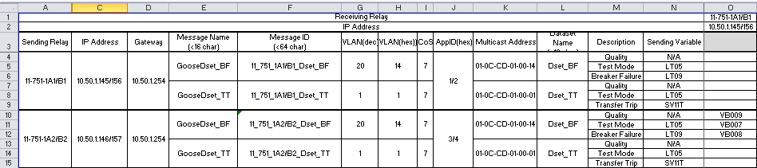

.. NWPPA Alaska 2013 Presentation
   Created by Keith Gray keith.gray at powereng dot com

IEC 61850 GOOSE Project - Start to Finish
=========================================

Keith Gray

POWER Engineers, Inc.

.. image:: static/power-logo.png

Outline
=======

.. contents::
   :depth: 1

Introduction
============

Who am I?
---------

* Keith Gray (keith.gray@powereng.com)
* SCADA and Protection Engineer for 8+ years
* 4+ years of experience with IEC 61850
* On initial team for company IEC 61850 Lab

What am I going to talk about today?
------------------------------------

* IEC 61850 GOOSE Review
* Description of the Project
* Description of the Communications Aided Schemes
* IEC 61850 GOOSE Implementation

  * Team Structure
  * Documentation
  * Implementation
  * Testing
  * Lessons Learned

* Questions

IEC 61850 Review
=================

The Standard
------------

* International Standard

  * Carries IEC name but is derived from work done in the US
    by IEEE/EPRI called UCA 2.0
  * 12+ Sections
  * Some sections are at Edition 1 and some are at Edition 2
  
The Standard (con't)
--------------------

* Covers wide range of topics

  * System and Project Management
  * Engineering Tools
  * Data Modeling
  * Hardware Requirements
  * Product Lifecycle
  * Conformance Testing
  * Communication Structure

* Related standards cover

  * Security
  * Switchgear
  * and more

Promise of IEC 61850
--------------------

* **Interoperability**
* **NOT** *Interchangeability*
* Copper Removal
* Design Time Reduction

Communication Structure
-----------------------

* Station Bus

  * SCADA Protocol (MMS)

    * Client-Server Model

  * Protection Protocol (GOOSE)

    * Peer-Peer Model

* Process Bus

  * Sampled Values (SMV)

Object Orientation
------------------

* Models substation apparatus as software models
* Standard naming convention

Protection (GOOSE)
------------------

* Generic Object Oriented Substation Event
* Unsolicited transmission of any IEC 61850 object (Analog and/or Binary)
* Peer-Peer
* Publish-Subscribe
* Directly from Application Layer to Data Link Layer

  * No TCP/UDP/IP
  * Direct Ethernet Protocol
  * FAST

GOOSE (con't)
-------------

* Messages repeated at regular interval
* Data change event causes message to be published immediately
* Repeated at gradually larger interval until steady state repeat time
  is reached
* Allows *Virtual Wire Monitoring*

Engineering Process
-------------------

* Multiple steps
* Iterative
* Multiple software applications
* Defined in Section 6 of the IEC 61850 Standard

Process Overview
----------------

#. IED configuration tool provides a template file for each IED
#. System configuration tool imports all IED template files
#. Engineer performs GOOSE configuration in the system configuration tool
#. System configuration tool exports the substation configuration file
#. IED configuration tool imports the substation configuration file and
   sends the IED configuration to each IED

Substation Configuration Language
---------------------------------

**ICD - IED Configuration Description**
  The ICD file is a template file for each IED. It can be provided by
  the IED vendor or generated by the IED itself.

**CID - Configured IED Description**
  The CID file describes the configuration of the IED after the Engineering
  process has occurred. This file is generated by the IED
  configuration tool. It is sent to the relay for final programming.

**SCD - Substation Configuration Description**
  The SCD file describes the configuration of the entire substation after
  the engineering process has occurred. It is generated by the substation
  configuration tool.

IID, SSD, IED are less used file types defined in the standard.

Project Description
===================

Overall Project
---------------

* Industrial Facility
* Electric System Reliability Upgrade
* Onsite COGEN - Steam and Electricity
* Utility inter-tie substation at 46kV
* Main substation at 13.8kV
* Distribution centers at 4.16kV and 2.4kV
* COGEN connected at 13.8kV

Reliability Improvements
------------------------

* Separate the two COGEN units onto two buses
* Dual feed from the utility
* Main-tie-tie-Main at Main Substation
* Main-tie-Main at distribution substations
* Redundant feeds to load distribution centers

Scope
-----

* Substation Design
* Transmission Line Design
* Short-circuit and Arc Flash Studies -> Protective Relay Settings
* Facility wide Electrical SCADA system
* Communications Aided Scheme Design
* Field Commissioning

Communications Aided Schemes
----------------------------

* Breaker Failure
* Transfer Trip
* Islanding
* Remote Metering
* Remote Automatic and Manual Generator Synchronizing

Breaker Failure
---------------

* Protective relay issues a trip
* Breaker fails to open
* Protective relay sends a 'Breaker Failure Trip' signal to all source
  breaker relays on the bus
* GOOSE only (N-1 analysis)
* Some Results

  * BFT received - BFT transmitted = 3ms
  * Trip contact closed - BFT transmitted = 7ms
  * Source breaker open - BFT transmitted = 50ms

Transfer Trip
-------------

* Lowside main breaker relay sends transfer trip to highside breaker relay
  to clear lowside ground faults and transformer faults
* Redundant Channels - GOOSE and Vendor Specific
* Partially tested at this point due to the state of Phase II

Islanding
---------

* GOOSE Only
* Monitors breaker status for all breakers between the generators and the
  utility
* Logic is performed to tell the control system whether the unit is
  connected to the utility or not

Remote Metering
---------------

* GOOSE Only
* Analog data is transmitted from the main transformers to the CoGen
  where net metering calculations are performed
* Net metering values are sent to the DCS

Generator Synchronization
-------------------------

* Breaker statuses are monitored to determine which generator to control
* Automatic synchronizing done via GOOSE
* Manual synchronizing done via vendor specific protocol

Design Process
==============

Functional Specifications
-------------------------

* Each scheme is documented in a separate functional specification
* How should the scheme work
* Transmit/Receive GOOSE message contents
* LED/Pushbutton/Display Message definitions
* Hardware I/O
* How should it fail
* SCADA
* Test Mode
* SER

Functional Specification Example
--------------------------------

.. image:: static/functional-spec-3.png

GOOSE Mapping Spreadsheet
-------------------------

* Developed in two stages because the actual relay settings are not 
  known at this time

  #. Everything but specific relay word bits

     * In Parallel to the functional specification

  #. Relay word bits

     * After bits have been assigned by relay programmer

* Transmitting Relays on the left
* Receiving relays across the top
* Intersection shows the mapped data

Logic Diagrams
--------------

* Derived from the functional specification and GOOSE spreadsheet
* Visual description of the logic used in the Communications Aided Schemes
* Shows GOOSE transmit data and GOOSE receive data

SCD File Engineering
--------------------

* Derived from functional specification and GOOSE spreadsheet
* Perform GOOSE Mapping in Engineering Software

IED Configurations
------------------

* Derived from functional specification, GOOSE spreadsheet, and logic 
  diagrams
* Also includes "normal" protection settings

Test Plans
----------

* Derived from functional specification and GOOSE spreadsheet
* Test normal and failure modes of operation
* May need separate test plans for bench test vs. field test

Document Flow
-------------

Team Structure
--------------

Testing
=======

Site Testing
------------

* Engineers who programmed the system were on site to commission it
* Most, but not all, devices were available and connected
* Unavailable devices were simulated using a test set capable of publishing
  and subscribing to GOOSE messages
* Test plans were followed, variances were noted and reviewed
* SERs were captured at each step in the test plan

Test Mode
---------

* Need a method of testing a relay without causing actions in receiving
  relays
* Similar to test switches
* Only meant to be used when the protected device is out of service

  * Breaker racked out or disconnect switches open
  * Not meant to be use on an in-service relay

* Transmitting relay is placed into test mode
* Test mode indication is transmitted with each GOOSE message
* If test mode is enabled, the receiving relay ignores the data in the
  incoming GOOSE message
* All receiving relays indicate they see the transmitting relay in test mode
* SCADA indicates a relay is in test mode and that all receiving relays
  agree

Network Testing
---------------

* Network is now part of the protection/automation system and needs to be
  tested accordingly
* What to test?

.. image:: static/network-testing.png

Lessons Learned
===============

Project Status
--------------

* Phase I is complete
* Phase II is being programmed

Technical Challenges
--------------------

* Always map the quality associated with each piece of data in a 
  GOOSE dataset

  * Settings Change Failure Mode

* Watch out for form 'a' contacts during a loss of relay power

  * Relay still has enough 'juice' to send the state change via 
    communications

* Incompatibilities still exist between manufacturers. It is safer
  to map all properties individually than as a structure

  * Test set and relay mis-match

* Use different logic variables for different schemes, even if
  they appear to be doing the same thing

  * Allows you the freedom to make changes to one scheme without affecting
    the other scheme
* Even if the PU/DO times are 0, map the timer output rather than the input

  * Saves time later if you decide to make PU or DO nonzero

* SER lists may not allow enough points to monitor everything
* IEDs have limits to the number of transmit and receive GOOSE messages
  they can accept
* Double check the desired communications failure state

Non-Technical Challenges
------------------------

* Expertise

  * Facility engineering and maintenance personnel probably won't know how
    to investigate a problem and therefore fix it

* Interaction between different disciplines

  * SCADA/Protection/Substations/Testing

Conclusion
==========

.. contents::
   :depth: 1

